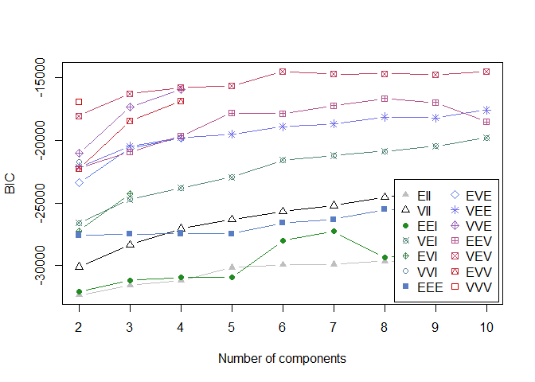
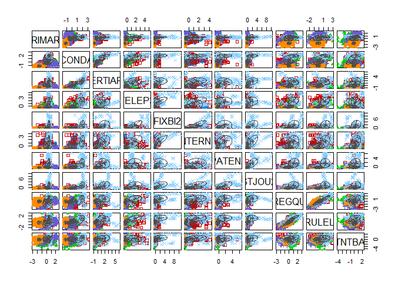
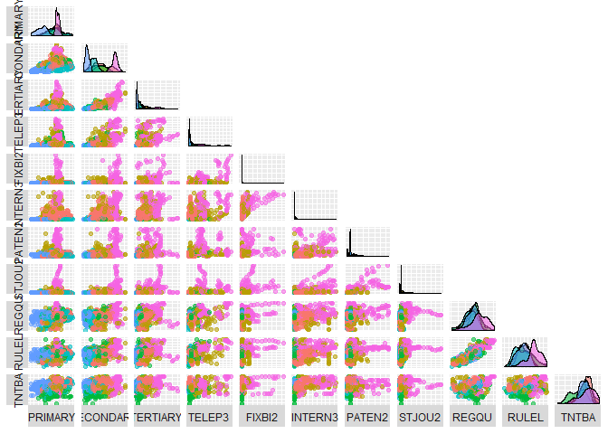
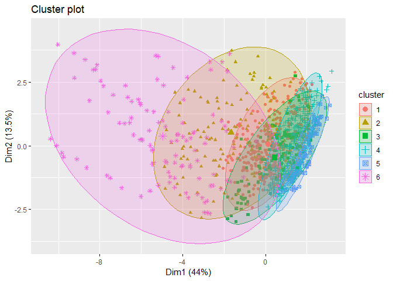

MixtureModels
================

``` r
library(GGally)
```

    ## Loading required package: ggplot2

    ## Warning: package 'ggplot2' was built under R version 3.5.3

``` r
library(tidyverse)
```

    ## Warning: package 'tidyverse' was built under R version 3.5.3

    ## -- Attaching packages --------------------------------------------------------------------------------------- tidyverse 1.2.1 --

    ## v tibble  2.1.1       v purrr   0.3.2  
    ## v tidyr   0.8.3       v dplyr   0.8.0.1
    ## v readr   1.3.1       v stringr 1.4.0  
    ## v tibble  2.1.1       v forcats 0.4.0

    ## Warning: package 'tibble' was built under R version 3.5.3

    ## Warning: package 'tidyr' was built under R version 3.5.3

    ## Warning: package 'purrr' was built under R version 3.5.3

    ## Warning: package 'dplyr' was built under R version 3.5.3

    ## Warning: package 'stringr' was built under R version 3.5.3

    ## Warning: package 'forcats' was built under R version 3.5.3

    ## -- Conflicts ------------------------------------------------------------------------------------------ tidyverse_conflicts() --
    ## x dplyr::filter() masks stats::filter()
    ## x dplyr::lag()    masks stats::lag()

``` r
library(ggplot2)
library(factoextra)
```

    ## Warning: package 'factoextra' was built under R version 3.5.3

    ## Welcome! Related Books: `Practical Guide To Cluster Analysis in R` at https://goo.gl/13EFCZ

``` r
library(pdp)
```

    ## Warning: package 'pdp' was built under R version 3.5.3

    ## 
    ## Attaching package: 'pdp'

    ## The following object is masked from 'package:purrr':
    ## 
    ##     partial

``` r
library (mclust)
```

    ## Warning: package 'mclust' was built under R version 3.5.3

    ## Package 'mclust' version 5.4.3
    ## Type 'citation("mclust")' for citing this R package in publications.

    ## 
    ## Attaching package: 'mclust'

    ## The following object is masked from 'package:purrr':
    ## 
    ##     map

``` r
# Read the dataset with imputed missing values using KNNs
afdata = read.csv("../data/afdata_imputed.csv", header = TRUE, dec = ".", sep = ",")
afdata$X = NULL
```

``` r
scaled_data <- as.data.frame(scale(afdata[, c(3:13)]))
mclust<- Mclust(scaled_data, G=2:10)
```

``` r
# 6 models were selected
mclust
```

    ## 'Mclust' model object: (VEV,6) 
    ## 
    ## Available components: 
    ##  [1] "call"           "data"           "modelName"      "n"             
    ##  [5] "d"              "G"              "BIC"            "bic"           
    ##  [9] "loglik"         "df"             "hypvol"         "parameters"    
    ## [13] "z"              "classification" "uncertainty"

``` r
summary(mclust, parameters = TRUE)
```

    ## ---------------------------------------------------- 
    ## Gaussian finite mixture model fitted by EM algorithm 
    ## ---------------------------------------------------- 
    ## 
    ## Mclust VEV (ellipsoidal, equal shape) model with 6 components: 
    ## 
    ##  log-likelihood    n  df       BIC       ICL
    ##       -5787.119 1150 417 -14513.05 -14624.42
    ## 
    ## Clustering table:
    ##   1   2   3   4   5   6 
    ## 273 131 143 326 164 113 
    ## 
    ## Mixing probabilities:
    ##         1         2         3         4         5         6 
    ## 0.2401581 0.1148274 0.1277456 0.2777723 0.1410643 0.0984323 
    ## 
    ## Means:
    ##                  [,1]        [,2]        [,3]         [,4]        [,5]
    ## PRIMARY    0.31622107  0.13081049  0.15928940  0.202398982 -1.55840371
    ## SECONDARY  0.12745360  0.79523498  0.01460617 -0.491782907 -1.21230197
    ## TERTIARY   0.04135861  0.83029341 -0.27290450 -0.477350056 -0.84969433
    ## TELEP3    -0.34927017  1.02493110 -0.01826317 -0.492760001 -0.50426646
    ## FIXBI2    -0.19698734  0.30059534 -0.28720307 -0.281253922 -0.28701827
    ## INTERN3    0.29853791  0.71323360 -0.54789270 -0.534207014 -0.61319351
    ## PATEN2    -0.19568019  0.46514325 -0.22188512 -0.357451360 -0.35517843
    ## STJOU2    -0.24792477  0.32227532 -0.16671469 -0.366413603 -0.28377675
    ## REGQU     -0.19617409 -0.01267889  0.40263886 -0.385128441  0.01314268
    ## RULEL     -0.17799882  0.20813744  0.24544870 -0.409248733 -0.18401465
    ## TNTBA      0.40156160  0.11176172 -1.01097443 -0.003219606 -0.12947132
    ##                [,6]
    ## PRIMARY   0.5313511
    ## SECONDARY 1.8675434
    ## TERTIARY  1.8494489
    ## TELEP3    1.7934364
    ## FIXBI2    1.7077022
    ## INTERN3   1.5369291
    ## PATEN2    1.7404953
    ## STJOU2    1.8859918
    ## REGQU     1.0388603
    ## RULEL     1.2915361
    ## TNTBA     0.3965570
    ## 
    ## Variances:
    ## [,,1]
    ##                 PRIMARY   SECONDARY    TERTIARY       TELEP3       FIXBI2
    ## PRIMARY    0.9903220836  0.25487508  0.04494979 -0.038856501  0.009819280
    ## SECONDARY  0.2548750762  0.64419263  0.48108138 -0.052003056  0.040114807
    ## TERTIARY   0.0449497923  0.48108138  0.46297567 -0.058076119  0.031150870
    ## TELEP3    -0.0388565013 -0.05200306 -0.05807612  0.044570766 -0.003793395
    ## FIXBI2     0.0098192795  0.04011481  0.03115087 -0.003793395  0.010295398
    ## INTERN3    0.0468953137  0.35862622  0.26890674 -0.056215549  0.081729792
    ## PATEN2     0.0465716793  0.04098696  0.02401247 -0.006074288  0.008644494
    ## STJOU2    -0.0009601065  0.05534475  0.04009289 -0.008128063  0.010605354
    ## REGQU      0.2914462260 -0.01177293 -0.12968503 -0.045728244  0.023358491
    ## RULEL      0.3833525804  0.04649058 -0.09464797 -0.012155975  0.026487376
    ## TNTBA      0.2233668152  0.02279083 -0.06155365 -0.080913440  0.025606090
    ##               INTERN3       PATEN2        STJOU2       REGQU       RULEL
    ## PRIMARY    0.04689531  0.046571679 -0.0009601065  0.29144623  0.38335258
    ## SECONDARY  0.35862622  0.040986960  0.0553447501 -0.01177293  0.04649058
    ## TERTIARY   0.26890674  0.024012465  0.0400928926 -0.12968503 -0.09464797
    ## TELEP3    -0.05621555 -0.006074288 -0.0081280634 -0.04572824 -0.01215597
    ## FIXBI2     0.08172979  0.008644494  0.0106053537  0.02335849  0.02648738
    ## INTERN3    1.00116205  0.056891535  0.1256807894  0.38919012  0.37644862
    ## PATEN2     0.05689154  0.192443476  0.0867262575  0.12219574  0.07286474
    ## STJOU2     0.12568079  0.086726258  0.0786085941  0.13144111  0.10502344
    ## REGQU      0.38919012  0.122195743  0.1314411129  1.50714112  1.24601215
    ## RULEL      0.37644862  0.072864743  0.1050234389  1.24601215  1.21873018
    ## TNTBA      0.34357996  0.018773027  0.0198652468  0.71815937  0.60322031
    ##                 TNTBA
    ## PRIMARY    0.22336682
    ## SECONDARY  0.02279083
    ## TERTIARY  -0.06155365
    ## TELEP3    -0.08091344
    ## FIXBI2     0.02560609
    ## INTERN3    0.34357996
    ## PATEN2     0.01877303
    ## STJOU2     0.01986525
    ## REGQU      0.71815937
    ## RULEL      0.60322031
    ## TNTBA      0.75002753
    ## [,,2]
    ##              PRIMARY   SECONDARY  TERTIARY     TELEP3      FIXBI2
    ## PRIMARY    0.9122154  1.11888778 0.8286660  1.3286282 -0.15052079
    ## SECONDARY  1.1188878  2.22236267 1.8643838  2.3654029 -0.14555889
    ## TERTIARY   0.8286660  1.86438385 1.9234537  1.2236769  0.13881446
    ## TELEP3     1.3286282  2.36540289 1.2236769  4.9544916 -0.72366085
    ## FIXBI2    -0.1505208 -0.14555889 0.1388145 -0.7236608  1.01793336
    ## INTERN3   -0.1209618 -0.06807234 0.3841340 -0.9011206  1.75795488
    ## PATEN2    -0.2240529 -0.04012243 0.1887455 -0.3520863 -0.10525591
    ## STJOU2     0.2970999  0.62603316 0.6329060  0.4387067  0.00544277
    ## REGQU      0.6949695  1.61097113 1.0035137  1.9407001 -0.57894715
    ## RULEL      0.9126512  2.04141293 1.3289102  2.7185853 -0.51172313
    ## TNTBA      0.1176291  0.19028133 0.5300445 -0.3377182  0.95885374
    ##               INTERN3      PATEN2      STJOU2      REGQU       RULEL
    ## PRIMARY   -0.12096176 -0.22405287  0.29709994  0.6949695  0.91265124
    ## SECONDARY -0.06807234 -0.04012243  0.62603316  1.6109711  2.04141293
    ## TERTIARY   0.38413396  0.18874550  0.63290596  1.0035137  1.32891022
    ## TELEP3    -0.90112056 -0.35208630  0.43870673  1.9407001  2.71858533
    ## FIXBI2     1.75795488 -0.10525591  0.00544277 -0.5789471 -0.51172313
    ## INTERN3    3.73907148 -0.11039252 -0.07491605 -1.1254488 -0.82411442
    ## PATEN2    -0.11039252  1.28945061  0.58598304  0.6702076  0.46272725
    ## STJOU2    -0.07491605  0.58598304  0.66118572  0.9616145  0.94120694
    ## REGQU     -1.12544885  0.67020760  0.96161451  4.6578862  4.37840810
    ## RULEL     -0.82411442  0.46272725  0.94120694  4.3784081  4.52539711
    ## TNTBA      1.72282623 -0.28886452  0.02640561 -0.3501143 -0.09675409
    ##                 TNTBA
    ## PRIMARY    0.11762907
    ## SECONDARY  0.19028133
    ## TERTIARY   0.53004452
    ## TELEP3    -0.33771816
    ## FIXBI2     0.95885374
    ## INTERN3    1.72282623
    ## PATEN2    -0.28886452
    ## STJOU2     0.02640561
    ## REGQU     -0.35011429
    ## RULEL     -0.09675409
    ## TNTBA      2.18799640
    ## [,,3]
    ##                 PRIMARY    SECONDARY      TERTIARY       TELEP3
    ## PRIMARY    0.5199585137  0.306714702  0.0458819513 0.1171458556
    ## SECONDARY  0.3067147023  0.442033086  0.1428859026 0.2031427317
    ## TERTIARY   0.0458819513  0.142885903  0.1770480617 0.0256393434
    ## TELEP3     0.1171458556  0.203142732  0.0256393434 0.2668355571
    ## FIXBI2     0.0004781498  0.001112930  0.0011046624 0.0001188235
    ## INTERN3    0.0251669263  0.037141474  0.0130566800 0.0207996516
    ## PATEN2    -0.0087908906 -0.005795613  0.0009584786 0.0045816646
    ## STJOU2    -0.0021844066 -0.001480229  0.0017305069 0.0044945740
    ## REGQU      0.0928855199  0.140744268 -0.0207973416 0.0703791275
    ## RULEL      0.0890368385  0.175394069 -0.0136480616 0.2038832421
    ## TNTBA      0.2183991166  0.398283933  0.1876017734 0.2145401901
    ##                  FIXBI2       INTERN3        PATEN2        STJOU2
    ## PRIMARY    4.781498e-04  2.516693e-02 -0.0087908906 -2.184407e-03
    ## SECONDARY  1.112930e-03  3.714147e-02 -0.0057956128 -1.480229e-03
    ## TERTIARY   1.104662e-03  1.305668e-02  0.0009584786  1.730507e-03
    ## TELEP3     1.188235e-04  2.079965e-02  0.0045816646  4.494574e-03
    ## FIXBI2     1.681155e-03  5.240522e-04 -0.0001996679  1.807166e-04
    ## INTERN3    5.240522e-04  1.804311e-02 -0.0040414660  5.239805e-05
    ## PATEN2    -1.996679e-04 -4.041466e-03  0.0232515785  1.001635e-02
    ## STJOU2     1.807166e-04  5.239805e-05  0.0100163549  1.276938e-02
    ## REGQU      2.699293e-05  2.348413e-02 -0.0021311952  2.185748e-03
    ## RULEL     -4.846847e-04  1.930594e-02  0.0129045503  1.461596e-02
    ## TNTBA      2.005952e-03  7.541481e-02 -0.0173408283 -1.994868e-03
    ##                   REGQU         RULEL        TNTBA
    ## PRIMARY    9.288552e-02  0.0890368385  0.218399117
    ## SECONDARY  1.407443e-01  0.1753940685  0.398283933
    ## TERTIARY  -2.079734e-02 -0.0136480616  0.187601773
    ## TELEP3     7.037913e-02  0.2038832421  0.214540190
    ## FIXBI2     2.699293e-05 -0.0004846847  0.002005952
    ## INTERN3    2.348413e-02  0.0193059352  0.075414809
    ## PATEN2    -2.131195e-03  0.0129045503 -0.017340828
    ## STJOU2     2.185748e-03  0.0146159569 -0.001994868
    ## REGQU      4.757689e-01  0.4266131633  0.210314320
    ## RULEL      4.266132e-01  0.7296525796  0.293902125
    ## TNTBA      2.103143e-01  0.2939021249  1.131437824
    ## [,,4]
    ##                PRIMARY     SECONDARY      TERTIARY        TELEP3
    ## PRIMARY    0.698009717  1.285603e-02 -4.045761e-02 -4.777434e-03
    ## SECONDARY  0.012856034  1.425020e-01  6.718015e-02  6.768433e-03
    ## TERTIARY  -0.040457614  6.718015e-02  8.596583e-02  9.886398e-05
    ## TELEP3    -0.004777434  6.768433e-03  9.886398e-05  6.743813e-03
    ## FIXBI2     0.001010153 -4.889988e-05  3.124606e-04  2.627404e-05
    ## INTERN3    0.015029388  6.909778e-03  6.867138e-03  4.078532e-04
    ## PATEN2    -0.047958574  2.776869e-03  4.571740e-03 -4.779429e-04
    ## STJOU2    -0.027788295 -1.339993e-03 -7.893362e-03  2.919381e-03
    ## REGQU      0.240888224 -1.532944e-02 -2.080494e-02  5.864401e-03
    ## RULEL      0.160642526 -1.000437e-02 -5.247024e-02  2.182820e-02
    ## TNTBA      0.222205739  1.977966e-02 -4.271886e-04  6.807060e-03
    ##                  FIXBI2       INTERN3        PATEN2        STJOU2
    ## PRIMARY    1.010153e-03  0.0150293881 -4.795857e-02 -0.0277882946
    ## SECONDARY -4.889988e-05  0.0069097785  2.776869e-03 -0.0013399925
    ## TERTIARY   3.124606e-04  0.0068671377  4.571740e-03 -0.0078933619
    ## TELEP3     2.627404e-05  0.0004078532 -4.779429e-04  0.0029193806
    ## FIXBI2     1.335370e-03  0.0010351360  3.151831e-05 -0.0006136447
    ## INTERN3    1.035136e-03  0.0122410671  5.241518e-04 -0.0058022464
    ## PATEN2     3.151831e-05  0.0005241518  8.797611e-02  0.0163765142
    ## STJOU2    -6.136447e-04 -0.0058022464  1.637651e-02  0.0289914171
    ## REGQU      1.539438e-03  0.0065046446 -3.000158e-02 -0.0003436471
    ## RULEL     -8.510502e-05  0.0005255776 -2.011211e-02  0.0102447461
    ## TNTBA      4.267058e-03  0.0323118031  5.177633e-03 -0.0301111543
    ##                   REGQU         RULEL         TNTBA
    ## PRIMARY    0.2408882240  1.606425e-01  0.2222057392
    ## SECONDARY -0.0153294425 -1.000437e-02  0.0197796570
    ## TERTIARY  -0.0208049387 -5.247024e-02 -0.0004271886
    ## TELEP3     0.0058644008  2.182820e-02  0.0068070597
    ## FIXBI2     0.0015394381 -8.510502e-05  0.0042670578
    ## INTERN3    0.0065046446  5.255776e-04  0.0323118031
    ## PATEN2    -0.0300015775 -2.011211e-02  0.0051776326
    ## STJOU2    -0.0003436471  1.024475e-02 -0.0301111543
    ## REGQU      0.6101909984  4.724135e-01  0.1769781797
    ## RULEL      0.4724134983  5.951243e-01  0.1674231288
    ## TNTBA      0.1769781797  1.674231e-01  0.5432008700
    ## [,,5]
    ##                 PRIMARY     SECONDARY      TERTIARY        TELEP3
    ## PRIMARY    0.2389103145  3.324505e-02  0.0239878310  3.737382e-03
    ## SECONDARY  0.0332450534  4.184888e-02  0.0107127169  6.682819e-03
    ## TERTIARY   0.0239878310  1.071272e-02  0.0083375929  1.422629e-03
    ## TELEP3     0.0037373822  6.682819e-03  0.0014226288  1.002200e-02
    ## FIXBI2     0.0003289077  4.076496e-04  0.0002921940  1.227451e-04
    ## INTERN3    0.0028743757  1.864086e-03  0.0009293303  1.222418e-03
    ## PATEN2    -0.0147982474 -7.271181e-03 -0.0029729104 -3.019305e-04
    ## STJOU2    -0.0136548342 -5.008263e-03 -0.0036632264  3.338374e-05
    ## REGQU      0.0593000082 -9.817367e-04  0.0106769201  7.575139e-03
    ## RULEL      0.0343820470 -2.691533e-05  0.0075965837  6.353456e-03
    ## TNTBA      0.0766192438 -2.710246e-03  0.0083937598  6.297260e-04
    ##                  FIXBI2       INTERN3        PATEN2        STJOU2
    ## PRIMARY    0.0003289077  0.0028743757 -0.0147982474 -1.365483e-02
    ## SECONDARY  0.0004076496  0.0018640862 -0.0072711813 -5.008263e-03
    ## TERTIARY   0.0002921940  0.0009293303 -0.0029729104 -3.663226e-03
    ## TELEP3     0.0001227451  0.0012224182 -0.0003019305  3.338374e-05
    ## FIXBI2     0.0007184530  0.0006007497  0.0001549839 -6.080017e-04
    ## INTERN3    0.0006007497  0.0025223435 -0.0005090097 -3.160227e-03
    ## PATEN2     0.0001549839 -0.0005090097  0.0476901247  1.987612e-02
    ## STJOU2    -0.0006080017 -0.0031602272  0.0198761195  2.619642e-02
    ## REGQU      0.0002125341  0.0010220732  0.0142940089  7.726421e-03
    ## RULEL      0.0004360978  0.0008434761  0.0170917974  9.270841e-03
    ## TNTBA      0.0002407539  0.0013418999  0.0104943304 -1.983842e-03
    ##                   REGQU         RULEL         TNTBA
    ## PRIMARY    0.0593000082  3.438205e-02  0.0766192438
    ## SECONDARY -0.0009817367 -2.691533e-05 -0.0027102458
    ## TERTIARY   0.0106769201  7.596584e-03  0.0083937598
    ## TELEP3     0.0075751387  6.353456e-03  0.0006297260
    ## FIXBI2     0.0002125341  4.360978e-04  0.0002407539
    ## INTERN3    0.0010220732  8.434761e-04  0.0013418999
    ## PATEN2     0.0142940089  1.709180e-02  0.0104943304
    ## STJOU2     0.0077264208  9.270841e-03 -0.0019838415
    ## REGQU      0.2754740774  1.965840e-01  0.1180681516
    ## RULEL      0.1965839998  2.824674e-01  0.0903363712
    ## TNTBA      0.1180681516  9.033637e-02  0.2627456825
    ## [,,6]
    ##                PRIMARY   SECONDARY    TERTIARY      TELEP3     FIXBI2
    ## PRIMARY    0.045240419 -0.03162895 -0.04871805 -0.03478882  0.0317125
    ## SECONDARY -0.031628947  0.20305720  0.41487211  0.03286984  0.3899794
    ## TERTIARY  -0.048718048  0.41487211  2.37303353 -0.26856255  0.7173729
    ## TELEP3    -0.034788817  0.03286984 -0.26856255  2.29162745  3.5376581
    ## FIXBI2     0.031712495  0.38997941  0.71737289  3.53765809 10.5437013
    ## INTERN3   -0.004294862  0.29475928  0.68356488  1.32905142  5.2051568
    ## PATEN2    -0.051234369 -0.06463079 -0.84001247 -0.21839145 -0.2996405
    ## STJOU2     0.076379802  0.32140055  0.91299400  0.28053939  2.8888318
    ## REGQU     -0.123436700 -0.01235358 -0.79506431  0.69108767  0.8813703
    ## RULEL     -0.070724438 -0.06117504 -0.78600003  0.77878546  0.8067201
    ## TNTBA     -0.145855274  0.16379753  0.39369821  0.10205672  1.0257478
    ##                INTERN3      PATEN2      STJOU2       REGQU       RULEL
    ## PRIMARY   -0.004294862 -0.05123437  0.07637980 -0.12343670 -0.07072444
    ## SECONDARY  0.294759276 -0.06463079  0.32140055 -0.01235358 -0.06117504
    ## TERTIARY   0.683564878 -0.84001247  0.91299400 -0.79506431 -0.78600003
    ## TELEP3     1.329051423 -0.21839145  0.28053939  0.69108767  0.77878546
    ## FIXBI2     5.205156827 -0.29964049  2.88883176  0.88137032  0.80672007
    ## INTERN3    3.480190254  0.19168754  2.50586854  0.21633810  0.22203039
    ## PATEN2     0.191687537  4.47391570  2.35416390  0.64226567  0.11420438
    ## STJOU2     2.505868542  2.35416390  5.82863417  0.17489819 -0.06359781
    ## REGQU      0.216338099  0.64226567  0.17489819  1.65963160  1.15717089
    ## RULEL      0.222030394  0.11420438 -0.06359781  1.15717089  1.00897893
    ## TNTBA      0.680471419  0.03474573  0.08369424  0.82902240  0.44048518
    ##                 TNTBA
    ## PRIMARY   -0.14585527
    ## SECONDARY  0.16379753
    ## TERTIARY   0.39369821
    ## TELEP3     0.10205672
    ## FIXBI2     1.02574775
    ## INTERN3    0.68047142
    ## PATEN2     0.03474573
    ## STJOU2     0.08369424
    ## REGQU      0.82902240
    ## RULEL      0.44048518
    ## TNTBA      1.50865644

``` r
plot(mclust, what="BIC")
```



``` r
plot(mclust, what="classification")
```



``` r
# Scatter plots for all variables and higlighting cluster groups
ggpairs(cbind(scaled_data, Cluster=as.factor(mclust$classification)),
        columns=1:11, aes(colour=Cluster, alpha=0.5),
        lower=list(continuous="points"),
        upper=list(continuous="blank"),
        axisLabels="none", switch="both")
```



``` r
#try to interpret clusters
summary(afdata[mclust$classification==1,])
```

    ##                   Country         Year         PRIMARY      
    ##  Sao Tome and Principe: 16   Min.   :1995   Min.   : 59.85  
    ##  Comoros              : 15   1st Qu.:2009   1st Qu.: 92.04  
    ##  Gabon                : 13   Median :2012   Median :101.78  
    ##  Gambia, The          : 13   Mean   :2011   Mean   :102.01  
    ##  Zimbabwe             : 13   3rd Qu.:2015   3rd Qu.:110.40  
    ##  Nigeria              : 12   Max.   :2017   Max.   :146.52  
    ##  (Other)              :191                                  
    ##    SECONDARY        TERTIARY          TELEP3           FIXBI2      
    ##  Min.   :18.75   Min.   : 1.152   Min.   : 0.000   Min.   :0.0000  
    ##  1st Qu.:36.27   1st Qu.: 5.490   1st Qu.: 4.559   1st Qu.:0.2905  
    ##  Median :45.04   Median : 8.754   Median :11.075   Median :1.1852  
    ##  Mean   :45.79   Mean   : 9.185   Mean   :14.847   Mean   :1.7066  
    ##  3rd Qu.:55.97   3rd Qu.:12.562   3rd Qu.:22.710   3rd Qu.:2.3633  
    ##  Max.   :82.03   Max.   :21.569   Max.   :47.656   Max.   :7.5857  
    ##                                                                    
    ##     INTERN3             PATEN2              STJOU2       
    ##  Min.   : 0.03101   Min.   :0.0000186   Min.   :0.00000  
    ##  1st Qu.: 5.05000   1st Qu.:0.0006017   1st Qu.:0.00474  
    ##  Median : 9.00000   Median :0.0016675   Median :0.01085  
    ##  Mean   :11.11187   Mean   :0.0017081   Mean   :0.01379  
    ##  3rd Qu.:15.19913   3rd Qu.:0.0023001   3rd Qu.:0.02066  
    ##  Max.   :48.05227   Max.   :0.0064036   Max.   :0.07315  
    ##                                                          
    ##      REGQU             RULEL             TNTBA      
    ##  Min.   :-2.2362   Min.   :-1.8523   Min.   :25.00  
    ##  1st Qu.:-1.0375   1st Qu.:-1.0785   1st Qu.:59.30  
    ##  Median :-0.7282   Median :-0.7111   Median :64.80  
    ##  Mean   :-0.7590   Mean   :-0.7532   Mean   :64.09  
    ##  3rd Qu.:-0.3786   3rd Qu.:-0.4007   3rd Qu.:70.80  
    ##  Max.   : 0.2465   Max.   : 0.1491   Max.   :85.80  
    ## 

``` r
summary(afdata[mclust$classification==2,])
```

    ##              Country        Year         PRIMARY         SECONDARY     
    ##  Egypt, Arab Rep.:14   Min.   :1995   Min.   : 49.42   Min.   : 17.55  
    ##  Libya           :14   1st Qu.:2004   1st Qu.: 91.46   1st Qu.: 44.42  
    ##  Morocco         :11   Median :2010   Median :101.78   Median : 59.12  
    ##  Djibouti        :10   Mean   :2009   Mean   : 97.78   Mean   : 61.43  
    ##  Mauritius       : 9   3rd Qu.:2014   3rd Qu.:109.30   3rd Qu.: 78.91  
    ##  Seychelles      : 9   Max.   :2017   Max.   :132.47   Max.   :114.38  
    ##  (Other)         :64                                                   
    ##     TERTIARY          TELEP3            FIXBI2            INTERN3        
    ##  Min.   : 2.465   Min.   :  2.218   Min.   : 0.00000   Min.   : 0.00529  
    ##  1st Qu.:10.156   1st Qu.: 37.561   1st Qu.: 0.01701   1st Qu.: 4.98744  
    ##  Median :14.567   Median : 75.950   Median : 6.92732   Median :12.14962  
    ##  Mean   :16.076   Mean   : 95.130   Mean   :10.80042   Mean   :15.86794  
    ##  3rd Qu.:21.281   3rd Qu.:126.445   3rd Qu.:18.92948   3rd Qu.:22.72141  
    ##  Max.   :36.323   Max.   :292.544   Max.   :36.23605   Max.   :57.16215  
    ##                                                                          
    ##      PATEN2              STJOU2             REGQU        
    ##  Min.   :0.0003381   Min.   :0.003402   Min.   :-2.2745  
    ##  1st Qu.:0.0017002   1st Qu.:0.017365   1st Qu.:-1.0904  
    ##  Median :0.0034427   Median :0.033486   Median :-0.5727  
    ##  Mean   :0.0036394   Mean   :0.038533   Mean   :-0.6494  
    ##  3rd Qu.:0.0048601   3rd Qu.:0.059158   3rd Qu.:-0.1859  
    ##  Max.   :0.0176463   Max.   :0.105279   Max.   : 0.6068  
    ##                                                          
    ##      RULEL              TNTBA      
    ##  Min.   :-1.81671   Min.   :25.00  
    ##  1st Qu.:-0.98467   1st Qu.:53.60  
    ##  Median :-0.65851   Median :58.92  
    ##  Mean   :-0.52204   Mean   :59.94  
    ##  3rd Qu.:-0.03233   3rd Qu.:70.95  
    ##  Max.   : 1.07713   Max.   :90.00  
    ## 

``` r
summary(afdata[mclust$classification==3,])
```

    ##        Country        Year         PRIMARY         SECONDARY     
    ##  Namibia   :14   Min.   :1995   Min.   : 50.54   Min.   : 8.398  
    ##  Algeria   :10   1st Qu.:1997   1st Qu.: 82.24   1st Qu.:29.929  
    ##  Gabon     :10   Median :1999   Median :101.00   Median :42.694  
    ##  Cabo Verde: 9   Mean   :1999   Mean   : 98.66   Mean   :43.252  
    ##  Botswana  : 8   3rd Qu.:2001   3rd Qu.:109.45   3rd Qu.:57.447  
    ##  Cameroon  : 7   Max.   :2011   Max.   :145.75   Max.   :77.938  
    ##  (Other)   :85                                                   
    ##     TERTIARY           TELEP3             FIXBI2           INTERN3       
    ##  Min.   : 0.4901   Min.   :  0.2062   Min.   :0.00000   Min.   :0.00000  
    ##  1st Qu.: 3.7453   1st Qu.:  6.5508   1st Qu.:0.00000   1st Qu.:0.02022  
    ##  Median : 5.7275   Median : 27.0150   Median :0.00000   Median :0.17012  
    ##  Mean   : 6.5133   Mean   : 34.3134   Mean   :0.03688   Mean   :0.98376  
    ##  3rd Qu.: 8.3265   3rd Qu.: 55.8838   3rd Qu.:0.00000   3rd Qu.:1.27647  
    ##  Max.   :19.4521   Max.   :161.0065   Max.   :1.09652   Max.   :6.10000  
    ##                                                                          
    ##      PATEN2              STJOU2             REGQU        
    ##  Min.   :0.0001814   Min.   :0.004327   Min.   :-1.9113  
    ##  1st Qu.:0.0017002   1st Qu.:0.017365   1st Qu.:-0.6574  
    ##  Median :0.0017002   Median :0.017365   Median :-0.3834  
    ##  Mean   :0.0016418   Mean   :0.017162   Mean   :-0.4008  
    ##  3rd Qu.:0.0017002   3rd Qu.:0.017365   3rd Qu.:-0.1693  
    ##  Max.   :0.0034677   Max.   :0.034862   Max.   : 0.7811  
    ##                                                          
    ##      RULEL              TNTBA      
    ##  Min.   :-2.00851   Min.   : 0.00  
    ##  1st Qu.:-0.90768   1st Qu.:27.50  
    ##  Median :-0.61758   Median :45.00  
    ##  Mean   :-0.49928   Mean   :43.54  
    ##  3rd Qu.:-0.09534   3rd Qu.:56.72  
    ##  Max.   : 1.04419   Max.   :89.00  
    ## 

``` r
summary(afdata[mclust$classification==4,])
```

    ##                      Country         Year         PRIMARY      
    ##  Malawi                  : 18   Min.   :1995   Min.   : 52.97  
    ##  Congo, Dem. Rep.        : 17   1st Qu.:2000   1st Qu.: 83.96  
    ##  Madagascar              : 17   Median :2005   Median : 97.80  
    ##  Sierra Leone            : 15   Mean   :2005   Mean   : 99.52  
    ##  Central African Republic: 14   3rd Qu.:2009   3rd Qu.:110.32  
    ##  Eritrea                 : 14   Max.   :2016   Max.   :152.22  
    ##  (Other)                 :231                                  
    ##    SECONDARY         TERTIARY           TELEP3           FIXBI2      
    ##  Min.   : 9.339   Min.   : 0.3093   Min.   : 0.000   Min.   :0.0000  
    ##  1st Qu.:24.745   1st Qu.: 2.8014   1st Qu.: 2.841   1st Qu.:0.0000  
    ##  Median :31.908   Median : 4.7405   Median : 5.498   Median :0.0000  
    ##  Mean   :31.730   Mean   : 4.8758   Mean   : 6.544   Mean   :0.1461  
    ##  3rd Qu.:38.089   3rd Qu.: 6.4013   3rd Qu.: 9.537   3rd Qu.:0.1142  
    ##  Max.   :60.225   Max.   :14.3300   Max.   :24.603   Max.   :1.7434  
    ##                                                                      
    ##     INTERN3           PATEN2              STJOU2         
    ##  Min.   :0.0000   Min.   :0.0000358   Min.   :0.0002362  
    ##  1st Qu.:0.1589   1st Qu.:0.0003251   1st Qu.:0.0021865  
    ##  Median :0.7398   Median :0.0016738   Median :0.0055301  
    ##  Mean   :1.2030   Mean   :0.0012406   Mean   :0.0084874  
    ##  3rd Qu.:1.8875   3rd Qu.:0.0017002   3rd Qu.:0.0173648  
    ##  Max.   :5.1736   Max.   :0.0045916   Max.   :0.0496955  
    ##                                                          
    ##      REGQU             RULEL             TNTBA      
    ##  Min.   :-2.2975   Min.   :-2.1300   Min.   :19.00  
    ##  1st Qu.:-1.1955   1st Qu.:-1.3047   1st Qu.:51.96  
    ##  Median :-0.8403   Median :-0.9253   Median :60.10  
    ##  Mean   :-0.8595   Mean   :-0.8881   Mean   :58.74  
    ##  3rd Qu.:-0.4829   3rd Qu.:-0.4794   3rd Qu.:67.59  
    ##  Max.   : 0.1537   Max.   : 0.3172   Max.   :82.80  
    ## 

``` r
summary(afdata[mclust$classification==5,])
```

    ##          Country        Year         PRIMARY        SECONDARY    
    ##  Niger       :20   Min.   :1995   Min.   :27.79   Min.   : 5.21  
    ##  Burkina Faso:15   1st Qu.:1997   1st Qu.:48.11   1st Qu.:11.11  
    ##  Chad        :13   Median :2000   Median :60.81   Median :14.13  
    ##  Djibouti    :13   Mean   :2001   Mean   :59.15   Mean   :14.77  
    ##  Ethiopia    :11   3rd Qu.:2003   3rd Qu.:70.31   3rd Qu.:18.55  
    ##  Mali        :11   Max.   :2014   Max.   :93.05   Max.   :26.38  
    ##  (Other)     :81                                                 
    ##     TERTIARY          TELEP3            FIXBI2           INTERN3        
    ##  Min.   :0.2199   Min.   : 0.2007   Min.   :0.00000   Min.   :0.000000  
    ##  1st Qu.:0.9486   1st Qu.: 2.5140   1st Qu.:0.00000   1st Qu.:0.009559  
    ##  Median :1.4347   Median : 4.2538   Median :0.00000   Median :0.107797  
    ##  Mean   :1.5770   Mean   : 5.7579   Mean   :0.04145   Mean   :0.244907  
    ##  3rd Qu.:2.1366   3rd Qu.: 7.6066   3rd Qu.:0.00000   3rd Qu.:0.352025  
    ##  Max.   :3.7223   Max.   :23.4013   Max.   :1.56432   Max.   :1.620000  
    ##                                                                         
    ##      PATEN2              STJOU2              REGQU        
    ##  Min.   :0.0000130   Min.   :0.0004347   Min.   :-1.8881  
    ##  1st Qu.:0.0002567   1st Qu.:0.0040832   1st Qu.:-0.8980  
    ##  Median :0.0017002   Median :0.0173647   Median :-0.5749  
    ##  Mean   :0.0012492   Mean   :0.0121350   Mean   :-0.6394  
    ##  3rd Qu.:0.0017002   3rd Qu.:0.0173647   3rd Qu.:-0.3169  
    ##  Max.   :0.0029402   Max.   :0.0173647   Max.   : 0.0448  
    ##                                                           
    ##      RULEL             TNTBA      
    ##  Min.   :-1.6585   Min.   :27.00  
    ##  1st Qu.:-1.1548   1st Qu.:49.15  
    ##  Median :-0.7280   Median :56.72  
    ##  Mean   :-0.7624   Mean   :56.63  
    ##  3rd Qu.:-0.4292   3rd Qu.:65.00  
    ##  Max.   : 0.0656   Max.   :75.70  
    ## 

``` r
summary(afdata[mclust$classification==6,])
```

    ##          Country        Year         PRIMARY         SECONDARY     
    ##  South Africa:20   Min.   :1995   Min.   : 96.66   Min.   : 40.76  
    ##  Tunisia     :16   1st Qu.:2006   1st Qu.:102.92   1st Qu.: 82.58  
    ##  Seychelles  :14   Median :2010   Median :107.21   Median : 86.67  
    ##  Mauritius   :13   Mean   :2009   Mean   :106.97   Mean   : 85.89  
    ##  Botswana    :12   3rd Qu.:2014   3rd Qu.:110.43   3rd Qu.: 91.87  
    ##  Cabo Verde  :10   Max.   :2017   Max.   :119.76   Max.   :107.59  
    ##  (Other)     :28                                                   
    ##     TERTIARY          TELEP3            FIXBI2           INTERN3       
    ##  Min.   : 1.379   Min.   :  7.104   Min.   :  0.000   Min.   : 0.1336  
    ##  1st Qu.:15.669   1st Qu.: 79.228   1st Qu.:  3.386   1st Qu.: 7.6071  
    ##  Median :24.636   Median :108.505   Median : 21.339   Median :27.5300  
    ##  Mean   :24.714   Mean   :136.678   Mean   : 36.017   Mean   :25.5777  
    ##  3rd Qu.:32.711   3rd Qu.:150.874   3rd Qu.: 47.209   3rd Qu.:40.5014  
    ##  Max.   :60.507   Max.   :326.526   Max.   :194.526   Max.   :56.5147  
    ##                                                                        
    ##      PATEN2              STJOU2              REGQU         
    ##  Min.   :0.0002156   Min.   :0.0008429   Min.   :-1.88809  
    ##  1st Qu.:0.0023931   1st Qu.:0.0371678   1st Qu.:-0.37703  
    ##  Median :0.0053554   Median :0.0887033   Median :-0.08205  
    ##  Mean   :0.0073535   Mean   :0.1051536   Mean   :-0.04340  
    ##  3rd Qu.:0.0125518   3rd Qu.:0.1230507   3rd Qu.: 0.46453  
    ##  Max.   :0.0209798   Max.   :0.4617632   Max.   : 1.12727  
    ##                                                            
    ##      RULEL             TNTBA      
    ##  Min.   :-1.4957   Min.   :23.00  
    ##  1st Qu.:-0.1293   1st Qu.:53.76  
    ##  Median : 0.1148   Median :66.90  
    ##  Mean   : 0.1170   Mean   :64.20  
    ##  3rd Qu.: 0.5323   3rd Qu.:77.00  
    ##  Max.   : 1.0541   Max.   :88.70  
    ## 

``` r
afdata[ , "ClusterDescription"] <- NA
n=length(afdata$Country)
i=1
while (i<=n)
{
  
  if (mclust$classification[i]==6) {
    afdata$ClusterDescription[i] <-"VeryGood"
  }  
  else if (mclust$classification[i]==2) {
    afdata$ClusterDescription[i] <-"Good"
  }  
  if (mclust$classification[i]==1) {
    afdata$ClusterDescription[i] <-"Fine"
  }  
  if (mclust$classification[i]==3) {
    afdata$ClusterDescription[i] <-"Bad"
  }  
  if (mclust$classification[i]==4) {
    afdata$ClusterDescription[i] <-"VeryBad"
  }  
  if (mclust$classification[i]==5) {
    afdata$ClusterDescription[i] <-"TheWorst"
  }
    i=i+1
}


## list of cluster assignments (pair country year changes over time)
o=order(mclust$classification)
lclust<-data.frame(afdata$Country[o],afdata$Year, afdata$ClusterDescription[o])
```

``` r
#we visualize countries per year to see how they are changing cluster
CountryYerarCluster<-data.frame(afdata$Country,afdata$Year, afdata$ClusterDescription)

# Cluster plot
fviz_cluster(mclust, data= scaled_data,geom = "point", frame.type = "norm")
```

    ## Warning: argument frame is deprecated; please use ellipse instead.

    ## Warning: argument frame.type is deprecated; please use ellipse.type
    ## instead.


