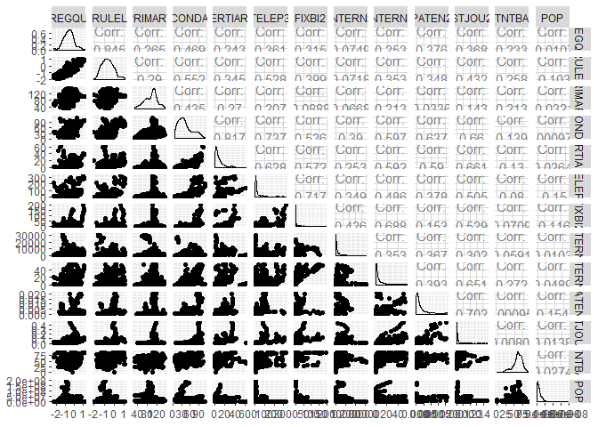
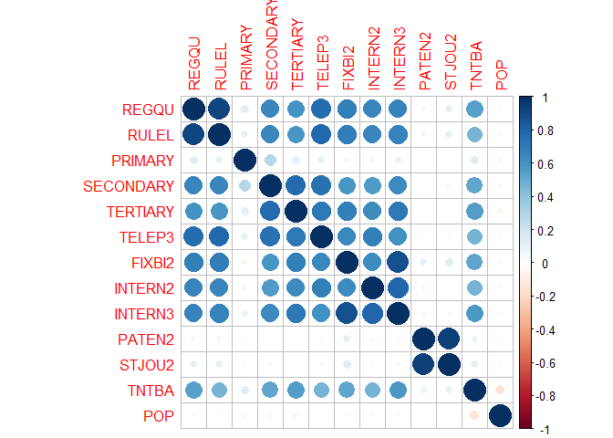

eda\_ke
================

``` r
library(tidyverse)
```

    ## -- Attaching packages ------------------------------------------------------------------------------------------------------ tidyverse 1.2.1 --

    ## v ggplot2 3.1.0     v purrr   0.2.5
    ## v tibble  2.0.1     v dplyr   0.7.8
    ## v tidyr   0.8.2     v stringr 1.3.1
    ## v readr   1.3.1     v forcats 0.3.0

    ## -- Conflicts --------------------------------------------------------------------------------------------------------- tidyverse_conflicts() --
    ## x dplyr::filter() masks stats::filter()
    ## x dplyr::lag()    masks stats::lag()

``` r
library(ggplot2)
library(corrplot)
```

    ## corrplot 0.84 loaded

``` r
library(GGally)
```

    ## 
    ## Attaching package: 'GGally'

    ## The following object is masked from 'package:dplyr':
    ## 
    ##     nasa

``` r
library(naniar)
library(readxl)
```

``` r
# read csv file
knowledge <- read.csv2("../data/KE_data_1995-2017 final version_cluster.csv", header = TRUE, dec = ",", sep = ";")
```

``` r
# Select subset of countries

afcountries <- c ("Algeria",    "Ethiopia", "Niger", "Angola", "Gabon", "Nigeria","Benin",
                    "Gambia",   "Rwanda", "Botswana", "Guinea Bissau", "South Africa", "Burkina Faso",
                  "Ghana", "Sao Tome and Principe", "Burundi", "Guinea", "Senegal", "Cameroon", "Kenya", "Seychelles","Cape Verde", "Lesotho", "Sierra Leone", "Central African Republic", "Liberia",   "Somalia", "Chad",  "Libya", "Sudan", "Cote d'Ivoire", "Madagascar", "Swaziland", "Comoros", "Malawi", "Tanzania", "Congo Democratic", "Mali", "Tunisia", "Congo Republic", "Mauritania", "Togo", "Djibouti", "Mauritius", "Uganda", "Egypt", "Morocco", "Zambia", "Equatorial Guinea", "Mozambique", "Zimbawe", "Eritrea", "Namibia")
```

``` r
# Dataframe with african countries
afdata <-subset(knowledge, knowledge$Country %in% afcountries)
```

``` r
# Generate regional dummiess
ca <- c("Angola", "Cameroon", "Cabo Verde", "Central African Republic", "Chad","Equatorial Guinea", "Eritrea", "Ethiopia",
        "Gabon", "Sao Tome and Principe")
afdata$Country.centralafrica <- ifelse(afdata$Country %in% ca,1,0)

ea <- c ("Burundi", "Comoros", "Congo Democratic Republic", "Congo Republic", "Djibouti", "Kenya",
         "Rwanda", "Seychelles", "Somalia", "Sudan", "Tanzania", "Uganda", "Zambia", "Zimbawe")

afdata$Country.eastafrica <- ifelse(afdata$Country %in% ea,1,0)

na <- c("Algeria", "Egypt", "Libya", "Mauritania", "Morocco", "Sudan", "Tunisia")
afdata$Country.northafrica <- ifelse(afdata$Country %in% na,1,0)

sa<-  c("Botswana", "Lesotho", "Madagascar", "Malawi", "Mauritius", "Mozambique", "Namibia", "South  Africa", "Swaziland")
afdata$Country.afdata <- ifelse(afdata$Country %in% sa,1,0)

wa <- c("Benin", "Burkina Faso", "Cote d'Ivoire", "Gambia", "Guinea Bissau", "Ghana", "Guinea", "Liberia", "Mali", "Niger", "Nigeria", "Senegal", "Sierra Leone", "Togo")
afdata$Country.westafrica <- ifelse(afdata$Country %in% wa,1,0)
```

``` r
summary (afdata)
```

    ##          Country         Year          REGQU             RULEL        
    ##  Algeria     : 23   Min.   :1995   Min.   :-2.2745   Min.   :-2.0085  
    ##  Angola      : 23   1st Qu.:2000   1st Qu.:-1.0087   1st Qu.:-1.0750  
    ##  Benin       : 23   Median :2006   Median :-0.6065   Median :-0.6658  
    ##  Botswana    : 23   Mean   :2006   Mean   :-0.6251   Mean   :-0.6349  
    ##  Burkina Faso: 23   3rd Qu.:2012   3rd Qu.:-0.2613   3rd Qu.:-0.2383  
    ##  Burundi     : 23   Max.   :2017   Max.   : 1.1273   Max.   : 1.0771  
    ##  (Other)     :874                  NA's   :176       NA's   :176      
    ##     PRIMARY         SECONDARY         TERTIARY           TELEP3       
    ##  Min.   : 27.79   Min.   :  5.21   Min.   : 0.2199   Min.   :  0.000  
    ##  1st Qu.: 76.59   1st Qu.: 22.80   1st Qu.: 2.3029   1st Qu.:  3.957  
    ##  Median :101.31   Median : 36.62   Median : 5.1957   Median :  9.548  
    ##  Mean   : 94.72   Mean   : 41.43   Mean   : 8.6272   Mean   : 33.150  
    ##  3rd Qu.:110.36   3rd Qu.: 55.66   3rd Qu.:10.4840   3rd Qu.: 29.462  
    ##  Max.   :152.22   Max.   :114.38   Max.   :60.5066   Max.   :326.526  
    ##  NA's   :176      NA's   :380      NA's   :431       NA's   :15       
    ##      FIXBI2            INTERN2            INTERN3            PATEN2      
    ##  Min.   :  0.0005   Min.   :    0.00   Min.   : 0.0000   Min.   :0.0000  
    ##  1st Qu.:  0.1799   1st Qu.:   90.79   1st Qu.: 0.2253   1st Qu.:0.0003  
    ##  Median :  1.0366   Median :  530.69   Median : 1.8200   Median :0.0011  
    ##  Mean   :  9.0613   Mean   : 1905.79   Mean   : 6.5437   Mean   :0.0035  
    ##  3rd Qu.:  5.0374   3rd Qu.: 1819.00   3rd Qu.: 7.8000   3rd Qu.:0.0043  
    ##  Max.   :194.5259   Max.   :30950.88   Max.   :56.5147   Max.   :0.0210  
    ##  NA's   :460        NA's   :123        NA's   :107       NA's   :782     
    ##      STJOU2           TNTBA            POP           
    ##  Min.   :0.0000   Min.   : 0.00   Min.   :    75304  
    ##  1st Qu.:0.0029   1st Qu.:53.90   1st Qu.:  3138378  
    ##  Median :0.0073   Median :61.90   Median : 10381348  
    ##  Mean   :0.0262   Mean   :60.31   Mean   : 17881032  
    ##  3rd Qu.:0.0204   3rd Qu.:70.30   3rd Qu.: 21839303  
    ##  Max.   :0.4618   Max.   :90.00   Max.   :190886311  
    ##  NA's   :401      NA's   :133     NA's   :6          
    ##  Country.centralafrica Country.eastafrica Country.northafrica
    ##  Min.   :0.0000        Min.   :0.0000     Min.   :0.0000     
    ##  1st Qu.:0.0000        1st Qu.:0.0000     1st Qu.:0.0000     
    ##  Median :0.0000        Median :0.0000     Median :0.0000     
    ##  Mean   :0.2045        Mean   :0.2273     Mean   :0.1364     
    ##  3rd Qu.:0.0000        3rd Qu.:0.0000     3rd Qu.:0.0000     
    ##  Max.   :1.0000        Max.   :1.0000     Max.   :1.0000     
    ##                                                              
    ##  Country.afdata   Country.westafrica
    ##  Min.   :0.0000   Min.   :0.0000    
    ##  1st Qu.:0.0000   1st Qu.:0.0000    
    ##  Median :0.0000   Median :0.0000    
    ##  Mean   :0.1591   Mean   :0.2727    
    ##  3rd Qu.:0.0000   3rd Qu.:1.0000    
    ##  Max.   :1.0000   Max.   :1.0000    
    ## 

``` r
# Number of countries included in the sample 

countrylist = unique(afdata$Country)
length(countrylist)
```

    ## [1] 44

``` r
# Number of time periods 

yearlist = unique(afdata$Year)
length(yearlist)
```

    ## [1] 23

``` r
# Number of missing values (% percentage)

prop_complete(afdata)
```

    ## [1] 0.8336957

``` r
pct_miss(afdata)
```

    ## [1] 16.63043

``` r
#pattern of missing values in each variable
miss_var_summary(afdata[, c(3:15)])
```

    ## # A tibble: 13 x 3
    ##    variable  n_miss pct_miss
    ##    <chr>      <int>    <dbl>
    ##  1 PATEN2       782   77.3  
    ##  2 FIXBI2       460   45.5  
    ##  3 TERTIARY     431   42.6  
    ##  4 STJOU2       401   39.6  
    ##  5 SECONDARY    380   37.5  
    ##  6 REGQU        176   17.4  
    ##  7 RULEL        176   17.4  
    ##  8 PRIMARY      176   17.4  
    ##  9 TNTBA        133   13.1  
    ## 10 INTERN2      123   12.2  
    ## 11 INTERN3      107   10.6  
    ## 12 TELEP3        15    1.48 
    ## 13 POP            6    0.593

``` r
# using GGally to show a complete picture of the features to be used in the analysis

ggpairs(afdata[, c(3:15)])
```



``` r
# Correlation matrix

m = cor(knowledge[, c(3:15)], use ="pairwise")
m
```

    ##                 REGQU       RULEL     PRIMARY   SECONDARY    TERTIARY
    ## REGQU      1.00000000  0.91342055  0.12109359  0.65557662  0.59805523
    ## RULEL      0.91342055  1.00000000  0.10859370  0.65958977  0.58649524
    ## PRIMARY    0.12109359  0.10859370  1.00000000  0.28660678  0.11631912
    ## SECONDARY  0.65557662  0.65958977  0.28660678  1.00000000  0.77826903
    ## TERTIARY   0.59805523  0.58649524  0.11631912  0.77826903  1.00000000
    ## TELEP3     0.76082681  0.78065768  0.10953358  0.74058651  0.71656812
    ## FIXBI2     0.68578496  0.69416942 -0.06017171  0.58781642  0.68391768
    ## INTERN2    0.65157946  0.65498912  0.05492692  0.56588100  0.62432881
    ## INTERN3    0.66113973  0.66781827  0.08159307  0.63479606  0.71702985
    ## PATEN2     0.05227095  0.05712862  0.02437411  0.00122896 -0.01264116
    ## STJOU2     0.11260579  0.11305036  0.02704507  0.04844487  0.01790297
    ## TNTBA      0.54437729  0.46485886  0.13322297  0.52481851  0.55450801
    ## POP       -0.03188887 -0.02464761  0.03933281 -0.04761876 -0.06080535
    ##                TELEP3      FIXBI2     INTERN2     INTERN3      PATEN2
    ## REGQU      0.76082681  0.68578496  0.65157946  0.66113973  0.05227095
    ## RULEL      0.78065768  0.69416942  0.65498912  0.66781827  0.05712862
    ## PRIMARY    0.10953358 -0.06017171  0.05492692  0.08159307  0.02437411
    ## SECONDARY  0.74058651  0.58781642  0.56588100  0.63479606  0.00122896
    ## TERTIARY   0.71656812  0.68391768  0.62432881  0.71702985 -0.01264116
    ## TELEP3     1.00000000  0.64667601  0.68201040  0.60907309 -0.02907373
    ## FIXBI2     0.64667601  1.00000000  0.62797089  0.87841099  0.10317668
    ## INTERN2    0.68201040  0.62797089  1.00000000  0.79981585 -0.04418597
    ## INTERN3    0.60907309  0.87841099  0.79981585  1.00000000  0.03374147
    ## PATEN2    -0.02907373  0.10317668 -0.04418597  0.03374147  1.00000000
    ## STJOU2     0.03614912  0.13298810 -0.02065952  0.04561091  0.93441036
    ## TNTBA      0.46085814  0.52634209  0.46314377  0.57369948  0.07554918
    ## POP       -0.02730062 -0.02809106 -0.02925710 -0.02434732 -0.02910167
    ##                STJOU2       TNTBA         POP
    ## REGQU      0.11260579  0.54437729 -0.03188887
    ## RULEL      0.11305036  0.46485886 -0.02464761
    ## PRIMARY    0.02704507  0.13322297  0.03933281
    ## SECONDARY  0.04844487  0.52481851 -0.04761876
    ## TERTIARY   0.01790297  0.55450801 -0.06080535
    ## TELEP3     0.03614912  0.46085814 -0.02730062
    ## FIXBI2     0.13298810  0.52634209 -0.02809106
    ## INTERN2   -0.02065952  0.46314377 -0.02925710
    ## INTERN3    0.04561091  0.57369948 -0.02434732
    ## PATEN2     0.93441036  0.07554918 -0.02910167
    ## STJOU2     1.00000000  0.10828776 -0.02736502
    ## TNTBA      0.10828776  1.00000000 -0.14490284
    ## POP       -0.02736502 -0.14490284  1.00000000

``` r
corrplot(m)
```


